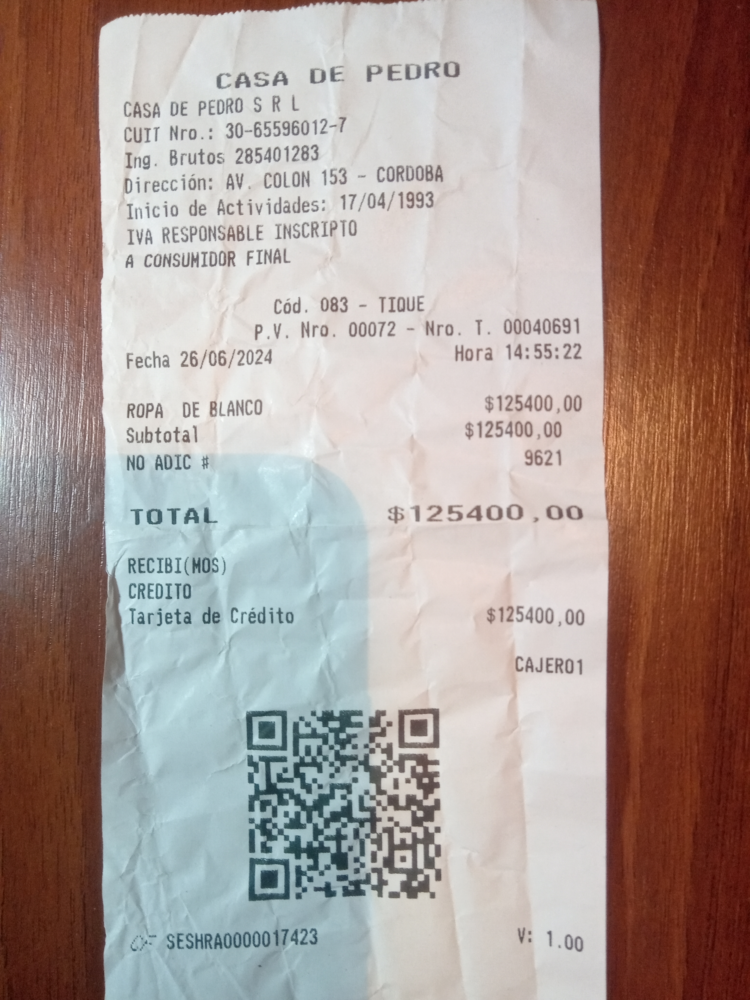
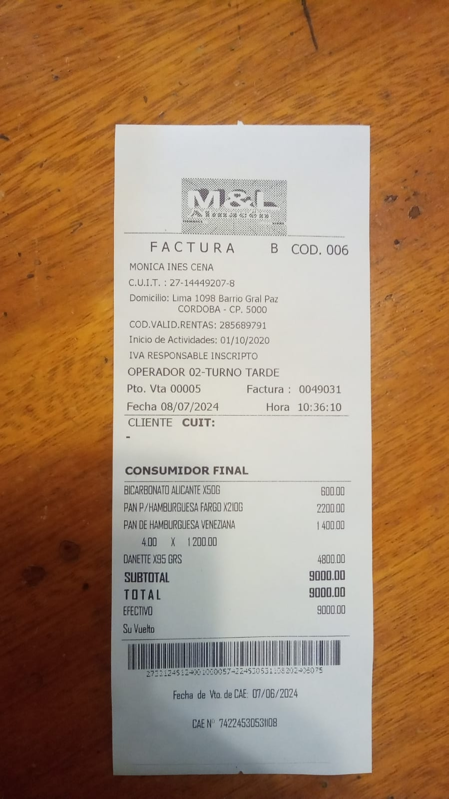

[](https://github.com/jackonedev/OCR_to_db/actions/workflows/ci_pipeline.yml)
# OCR_to_db

La idea es pasar de una imagen a un registro estructurado en forma de tabla dentro de una base de datos, todo hecho por medio de modelos de IA. Se espera que la fotogrofía sea un ticket comercial, ya que un modelo OCR la transforma a texto, para luego ser procesada por un modelo LLM que extraerá la información del texto y la convertirá en un formato tabla.

La siguiente App está desarrollada según los principios de CI pipelines de DevOps utilizando **GitHub Actions**, la orquestación de los docker containers es por medio de **Docker Compose**, el entorno de desarrollo fue combinado entre **GitHub Codespaces** y **VSCode - WSL Connection**.

La **arquitectura por micro-servicios** responde a la siguiente descripcion:
- **ocr_service:** con el modelo Tesseract de **Google** para Optical Character Recognition, que transforma la imagen en texto, es este servicio de API (hecho en **FastAPI**) el que inicia la comunicacion con el llm_service.
- **llm_service:** modelo LLM de **OpenAI** integrado por medio de la interface de **Langchain** y desplegado por medio de **LangServe**. El modelo dotado con la tool `Receipt` es capaz de extraer del texto valores para completar un esquema de tabla pre-definido con **Pydantic**.
- **RabbitMQ:** Message broker especializado para la comunicación entre diferentes servicios de una aplicación.

El producto final involucra la gestion de la base de datos por medio de inteligencia artificial, y también se pretende aceptar queries en natural language. Es decir, aún queda muchas features por desarrollar.


## Run the project

1. Run `docker-compose up` and the app will be running exposing port 8000.
2. Check if `localhost:8000/check` runs on the browser (you will see a hello message).
3. Go to `localhost:8000` and click "Try it out" in the OCR tag.
4. Use the interface to make a POST request to the `localhost:8000/ocr/images`, you can upload one or many images (that must contain text), and also set the language to Spanish (spa) or English (eng).
5. Click on the "Execute" button and check the response.


## Next Features

La idea es pasar de una imagen a un registro en una tabla dentro de una base de datos SQL que deberá ser gestionada por medio de inteligencia articficial. También se pretende aceptar queries en natural language, sin perder de consideración los aspectos convecionales de una app, como los usuarios y la interface UI.


**Upcoming Services:**

* **postgresql:**
	- almacenar registros en las bases de datos
	- recibir queries en natural language
	- gestion de registros existentes

* **app:**
	- gestion de usuario y base de datos
    - Protocolo de autorización oAuth2
	- comunicacion RestAPI con el resto de los servicios
	- Encargada de comunicarse con el supuesto servicio frontend

* **frontend:**
	- implementacion de chainlit para facil experiencia
	- Registro de usuario, login, cambio de contraseña
    - upload de imagenes
    - posterior generacion de chat model para correcciones
    - envio de esquema final

**TODOs:**

- SQLAlchemy
- LangGraph
- ...

## Example 1:

**Response:**
```
{
  "gran_registro.jpg": [
    "CASA DE PEDRO\n\nCASA DE PEDRO 5 RL\nCUIT Nro.: 30-65596012-7\nIng. Brutos 285401283\nAad AV. COLON 153 - CORDOBA\n\ncio de Actividades: 1 17/04/1993\n* RESPONSABLE INSI CRIP IO\nA CONSUMIDOR FINAL\n\nCod. 083 - TIQUE\npV. Nro. 00072 - Nro. T. 00040631\n\nROPA DE BLANCO 6125400 ,00\n\nSubtotal $ 125400 ,00\nNO ADIC # 9621\n\nTOTAL $125400 ,0o\na / RECIBI(MOS)\n\na CREDITO\n\nHe larjeta de Crédito $125400 00\n\nCAJERO1\n\nsee Le\nTv ae\n\no> SESHRAOOD0017423 VE 1.99\n\n",
    [
      {
        "name": "Receipt",
        "args": {
          "place": "CASA DE PEDRO",
          "tax_id": "30-65596012-7",
          "gross_income": "285401283",
          "address": "AV. COLON 153 - CORDOBA",
          "activity_start_date": "17/04/1993",
          "invoice_type": "TIQUE",
          "invoice_number": "00040631",
          "item_descriptions": [
            "ROPA DE BLANCO"
          ],
          "subtotal": "125400",
          "additional_charge": "9621",
          "total": "125400",
          "payment_method": "Tarjeta de Crédito",
          "cashier": "CAJERO1",
          "date": "2023-10-12T00:00:00Z"
        },
        "id": "call_hBSg9ygJwFWDf5f8fxuqLXxX"
      }
    ]
  ],
  "ocr_lang": "eng"
}
```

**Request:**



## Example 2:

**Response:**

```
{
  "mym-ticket-despe.jpg": [
    "yl\nñ\n>\nas\nA i\n+\ne\n5\nPe E e DE ESE\nS FACTURA B- COD. 006\n» MONICA INES CENA\nA C.U.LT. : 27-14949207-8\nDomicilio: Lim tio Gral Paz\ncc\n\nCOD.VALID.RENTAS:\nInicio de Actividades: 01/10/2\nIVA RESPONSABLE INSCRIPTO\n\nOPERADOR 02-TURNO TARDE\n\nPto, Vta 00005 Factura : 0049031\nFecha 08/07/2024 Hora 10:36:10\nCLIENTE CUIT:\n\nCONSUMIDOR FINAL\n\nBICARBONATO ALICANTE XS06 800.00\n\nPAN P/HAMBURGUESA FARGO NZ106 220000\n\nPAN DE HAMBURGUESA VENEZANA 1400.00\n400 X 120000\n\nDANETTE X95 GRS 4800.00\n9000.00\n9000.00\n\n3000.00\n\nA\n\npS\n",
    [
      {
        "name": "Receipt",
        "args": {
          "place": "MONICA INES CENA",
          "tax_id": "27-14449207-8", 
          "address": "Lim tio Gral Paz",
          "activity_start_date": "01/10/2",
          "invoice_type": "FACTURA B",
          "invoice_number": "0049031",
          "date": "2024-07-08T10:36:10",
          "item_descriptions": [
            "BICARBONATO ALICANTE XS06",
            "PAN P/HAMBURGUESA FARGO NZ106",
            "PAN DE HAMBURGUESA VENEZANA 400 X 120000",
            "DANETTE X95 GRS"
          ],
          "subtotal": "9000.00",
          "total": "9000.00",
          "cashier": "OPERADOR 02-TURNO TARDE"
        },
        "id": "call_pKP2DK1nDwbgiL3CWzvaNtz6"
      }
    ]
  ],
  "ocr_lang": "spa"
}
```

**Request:**

